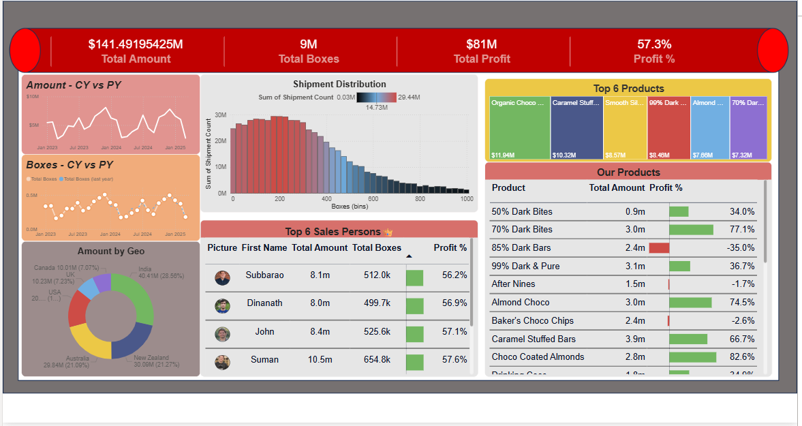

# Power BI Sales Analytics Dashboard

Interactive Sales Analytics Dashboard built using Power BI.

## Project Overview

This project analyzes sales, profit, products, shipments, salespersons, and geographical performance using Power BI.

## Tools Used

- Power BI
- Power Query
- DAX
- Data Modeling
- Interactive Visualizations

## Features

- Product Performance Analysis
- Profit Analysis
- Shipment Analysis
- Geo-wise Sales Analysis
- Salesperson Performance Analysis
- Interactive Filters and Slicers
- DAX Calendar Table
- Data Modeling & Relationships

## Dataset Tables

- Calendar
- Locations
- People
- Products
- Shipments

## Dashboard Preview

## Key Insights

- Sales performance across countries
- Product-wise revenue contribution
- Profit trend analysis
- Shipment distribution analysis
- Top performing salespersons
